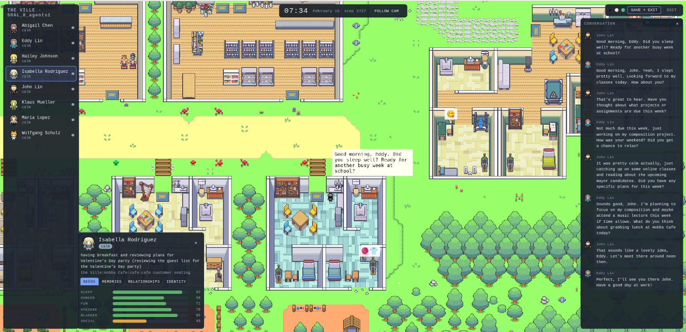

# Slice of Artificial Life: A Memory and Persona Architecture for Believable Generative-Agent Societies

<p align="center" width="100%">

</p>

This repository is the runnable system behind the thesis of the same name. It is a fork of
Stanford's Generative Agents (Park et al., 2023) rebuilt to run on a **local language model**, with
three layers of new work on top:

* **A memory retention model**: recency decayed on the simulated clock, importance and rehearsal
  lengthening a memory's half-life, and importance compared within each kind of memory;
* **Persona re-anchoring**: each character's daily identity rewrite is measured against the
  character as originally written and corrected when it drifts too far in content or in kind,
  with a calendar rule for identities built around dated events;
* **A live town**: an open-ended, resumable world with Sims-style needs, moods and per-character
  relationships, watched through its own browser interface.

Every mechanism sits behind a configuration flag. With every flag off, the system is the repaired
baseline exactly, the control condition of the thesis's evaluation, and the test suite proves it.
The configuration template ships with **every flag on**, so the `utils.py` you copy from it runs
the complete system with no editing; the two thesis conditions are one file edit away (see
[Running a measured simulation](#running-a-measured-simulation)).

Three complete runs ship with the repository, and all three can be replayed **without any model
installed** (see [Replaying the shipped runs](#replaying-the-shipped-runs)). Each consists of its
saved state under `environment/frontend_server/storage/<name>/`, its evaluation output in
`results/<name>.json`, and its model-call trace in `traces/`:

| run | what it is |
|---|---|
| `control_baseline_3day` | the control: repaired baseline, 3 characters, 3 simulated days |
| `treatment_full_system_3day` | the treatment: the full memory and persona system, same scenario |
| `livetown_8char_3day` | the live town: 8 characters, 3 days, every system on |
| `livetown_25char_halfday` | the live town: 25 characters, only half a day because it was too slow |

##    Repository layout

* `reverie/backend_server/`: the simulation backend. `reverie.py` is the stock entry point
  (measured runs); `run_livetown.py` is the town's. `memory_ext/` holds the research contribution
  (retention, retrieval, persona re-anchoring, longevity guardrails), `world_ext/` the town layer
  (needs, emotion, relationships, viewer snapshots), and `llm_trace.py` the record-and-replay
  harness for model calls.
* `environment/frontend_server/`: the Django environment server and every browser page;
  simulations live under its `storage/`.
* `evaluation/`: the memory and persona batteries, and the judge-versus-human agreement check.
* `tests/`: the pytest suite; no model needed.
* `tools/`: analysis tools for traces, retrieval behaviour and cast building.
* `results/`, `traces/`: the shipped runs' battery outputs and model-call traces.
* `CHANGES.md`: the ledger; `LICENSE`: Apache-2.0, inherited from upstream.

## Setup

1. **Python environment** (Python 3.10 or 3.11). Dependencies are pinned in `uv.lock`:

       uv sync

   or, with plain pip, `pip install -r requirements.txt`.

2. **Configuration.** Create your `utils.py` by copying the template:

       cp reverie/backend_server/utils_template.py reverie/backend_server/utils.py

   The template ships with **every flag on**, so the copy needs no editing to run the complete
   system. Every setting is documented in the file itself. `utils.py` is yours and is never
   committed (it is gitignored); the template is the committed reference.

3. **The local model.** Any OpenAI-compatible server works; the tested setup is
   [Ollama](https://ollama.com) serving Qwen2.5 14B:

       ollama pull qwen2.5:14b
       ollama serve

   The template points at `http://localhost:11434/v1` by default. Embeddings are computed locally
   with sentence-transformers (`all-MiniLM-L6-v2`), downloaded automatically on first use. No API
   key is required anywhere.

##    Running the live town

Two terminals. First the environment server:

    cd environment/frontend_server
    python manage.py runserver

"Then, on your favorite browser, go to [http://localhost:8000/](http://localhost:8000/). If you see a message that says, "Your environment server is up and running," your server is running properly. Ensure that the environment server continues to run while you are running the simulation, so keep this command-line tab open! (Note: I recommend using either Chrome or Safari. Firefox might produce some frontend glitches, although it should not interfere with the actual simulation.)" (Park et al.)

then the town:

    cd reverie/backend_server
    python run_livetown.py <TownName>

A new town asks for its cast size (3, 8 or 25 characters; `--cast` skips the question) and then
waits for the browser: open **http://localhost:8000/livetown**: the page drives the world clock.
The town needs no flag editing: the launcher applies the full profile (every contribution and
world-layer flag on) by itself, leaving `utils.py` untouched, and records a model-call trace to
`traces/livetown_<name>_<timestamp>.jsonl.gz` by default (`--no-trace` to opt out).

Each town is one persistent save: **SAVE + EXIT** in the viewer writes it and stops the backend,
**EXIT** stops without writing (the next launch resumes from the last checkpoint: the town
autosaves at every simulated midnight), and Ctrl-C in the terminal saves and stops. Launching the
same name again reopens the same world where it left off.

### The agent card

Clicking any character in the viewer opens their card: current action and address at the top,
then four tabs:

* **NEEDS**: the six Sims-style bars (Sleep, Hunger, Fun, Hygiene, Bladder, Social), 0–100,
  decaying on the simulated clock and refilled by what the character is actually doing; Social
  refills only through real conversation. A bar in the red forces the matching mood and puts one
  sentence into the character's identity block, which is how a deficit reaches planning and
  dialogue.
* **MEMORIES**: the most recent entries of the character's memory stream, colour-coded by
  category (place, event, conversation, reflection, plan, social) with poignancy shown as dots.
  Refreshed every few simulated minutes.
* **RELATIONSHIPS**: the character's own friendship and romance score for everyone they know, on
  a signed -100..100 scale drawn as centre-zero bars. Each side keeps its own scores, and the
  scores are read back into dialogue, so a one-sided crush plays one-sidedly.
* **IDENTITY**: the character as written (the permanent seed), who they are right now (the daily
  rewritten self-description), their traits, and the day-by-day drift record showing when
  re-anchoring corrected a rewrite.

## Running a measured simulation

The stock two-server flow, unchanged from upstream. With the environment server running (as
above), start the backend, recording a trace while you are at it:

    cd reverie/backend_server
    LLM_TRACE=record LLM_TRACE_FILE=../../traces/<name>.jsonl python reverie.py

At the prompts, fork `base_the_ville_isabella_maria_klaus` (the 3-character scenario; `_n8` and
`_n25` also ship), name the new simulation, then open
**http://localhost:8000/simulator_home** and enter `run <steps>` at the terminal prompt. One step
is 10 simulated seconds; one day is 8,640 steps; the thesis's runs are three days, `run 25920`.
`fin` saves and exits; the simulation resumes later by forking its own name. Optional agent
history (the character-sheet seeds) loads with `call -- load history the_ville/<file>.csv`.

Which condition you get is decided by your `utils.py`. A fresh copy of the template has **every
flag on**: the full system plus the world layer, the most watchable configuration but not one of
the thesis's measured conditions. To reproduce those, edit the copy:

* **Repaired baseline (control):** set every flag in the template's world-layer,
  research-contribution and town-guardrail sections to `False`.
* **Full system (treatment):** as the control, but with these six kept `True`:
  `recency_time_based`, `recency_access_persisted`, `importance_coupled_decay`,
  `rehearsal_strengthening`, `importance_within_type`, `persona_reanchor`.

The world layer and town guardrails stay off in measured runs, and the run header of every trace
records the exact configuration, so a trace is always evidence of which condition produced it.
(The live town is unaffected by any of this: its launcher applies the full profile itself,
whatever `utils.py` says.)

## Evaluation

Both batteries run against a *saved* simulation, out of band, and write one JSON file; nothing is
written into the simulation folder. They ask their questions through the agent's own retrieval and
prompting machinery, so they need the local model running, and `utils.py` set to the condition
that produced the simulation (see above), since retrieval answers under whatever flags are live:

    python evaluation/run.py --sim <simulation-name> --out results/<name>.json

The automatic judge is validated against a person. Draw the blind hand-scoring sheet, fill in a
grade after each item, then score the agreement (raw rate, Randolph's free-marginal kappa, and the
confusion table):

    python evaluation/agreement.py --sample results/<name>.json
    python evaluation/agreement.py --score results/handscore.md

My version of handscore.md is already shipped in `results/`.
The shipped `results/` files were produced exactly this way from the three shipped runs.

## Tests

    python -m pytest tests/

294 tests. They cover the frozen-baseline guarantee (flags off, the
live system returns byte-identical retrievals to the upstream algorithm), the retention and
persona mechanics, the world layer, the town lifecycle, and the evaluation instruments.

## Replaying the shipped runs

Everything a replay needs was recorded while the runs happened, so none of this requires a model.

**Watching a run.** With only the environment server running, open

    http://localhost:8000/replay/<simulation-name>/<starting-step>/

The browser steps through the run's recorded movement files. Useful starting points: step 2,520
is 7am on day one, 11,160 is 7am on day two (360 steps per hour). For a faster, seekable
animation, compress the run once and use demo mode with speeds 1 (slowest) to 6:

    cd reverie && python compress_sim_storage.py <simulation-name>
    http://localhost:8000/demo/<simulation-name>/<starting-step>/<speed>/

The live town run is best watched through its own interface, needs and moods included: write
`{"sim_code": "livetown_8char_3day"}` to `environment/frontend_server/temp_storage/curr_sim_code.json`
and `{"step": 0}` to `curr_step.json` in the same folder, then open
**http://localhost:8000/livetown**. With no backend running, the page steps through the recorded
world on its own. (The card tabs fed by a live backend show their waiting message during replay.)

**Re-running the simulation itself.** The traces let the backend re-run deterministically, with
recorded answers served back in place of a model: a simulated day that took an hour of GPU time
replays in minutes:

    cd reverie/backend_server
    LLM_TRACE=replay LLM_TRACE_FILE=../../traces/<trace-file> python reverie.py

then fork the same base and run the same step count as the original (for the town run, use the
same variables with `python run_livetown.py <any-new-name> --cast 8`). One prerequisite: set
`utils.py` to the condition that produced the run first (both thesis conditions are given above;
each trace's first record names the exact configuration). A replay under different flags asks the
model different questions and diverges from the recording. The town run needs no flag editing,
since its launcher applies the town profile itself. The reader accepts `.jsonl` or `.jsonl.gz`.

## Tools

* `tools/trace_report.py <trace>`: where a run's model time went, what was retried, and what
  each prompt's replies actually looked like.
* `tools/query_centrality.py`: why retrieval surfaces reflections over episodes for some
  characters; it measures each memory type's proximity to typical queries.
* `tools/make_base_n8.py`: rebuilds the 8-character starter town from the 25-character base.

---

## Upstream: Generative Agents

This repository is a fork of
[Generative Agents: Interactive Simulacra of Human Behavior](https://github.com/joonspk-research/generative_agents)
(taken at commit `fe05a71`), which provides the town, the agent loop, the memory stream and the
prompt templates. Everything below is upstream's, customisation as discussed below is untested here.

##    Simulation Storage Location
All simulations that you save will be located in `environment/frontend_server/storage`, and all compressed demos will be located in `environment/frontend_server/compressed_storage`.

##    Customization

There are two ways to optionally customize your simulations.

### Author and Load Agent History
First is to initialize agents with unique history at the start of the simulation. To do this, you would want to 1) start your simulation using one of the base simulations, and 2) author and load agent history. More specifically, here are the steps:

#### Step 1. Starting Up a Base Simulation
There are two base simulations included in the repository: `base_the_ville_n25` with 25 agents, and `base_the_ville_isabella_maria_klaus` with 3 agents. Load one of the base simulations by following the steps until step 2 above.

#### Step 2. Loading a History File
Then, when prompted with "Enter option: ", you should load the agent history by responding with the following command:

    call -- load history the_ville/<history_file_name>.csv
Note that you will need to replace `<history_file_name>` with the name of an existing history file. There are two history files included in the repo as examples: `agent_history_init_n25.csv` for `base_the_ville_n25` and `agent_history_init_n3.csv` for `base_the_ville_isabella_maria_klaus`. These files include semicolon-separated lists of memory records for each of the agents—loading them will insert the memory records into the agents' memory stream.

#### Step 3. Further Customization
To customize the initialization by authoring your own history file, place your file in the following folder: `environment/frontend_server/static_dirs/assets/the_ville`. The column format for your custom history file will have to match the example history files included. Therefore, we recommend starting the process by copying and pasting the ones that are already in the repository.

### Create New Base Simulations
For a more involved customization, you will need to author your own base simulation files. The most straightforward approach would be to copy and paste an existing base simulation folder, renaming and editing it according to your requirements. This process will be simpler if you decide to keep the agent names unchanged. However, if you wish to change their names or increase the number of agents that the Smallville map can accommodate, you might need to directly edit the map using the [Tiled](https://www.mapeditor.org/) map editor.


##    Authors and Citation

**Authors:** Joon Sung Park, Joseph C. O'Brien, Carrie J. Cai, Meredith Ringel Morris, Percy Liang, Michael S. Bernstein

Please cite our paper if you use the code or data in this repository.
```
@inproceedings{Park2023GenerativeAgents,
author = {Park, Joon Sung and O'Brien, Joseph C. and Cai, Carrie J. and Morris, Meredith Ringel and Liang, Percy and Bernstein, Michael S.},
title = {Generative Agents: Interactive Simulacra of Human Behavior},
year = {2023},
publisher = {Association for Computing Machinery},
address = {New York, NY, USA},
booktitle = {In the 36th Annual ACM Symposium on User Interface Software and Technology (UIST '23)},
keywords = {Human-AI interaction, agents, generative AI, large language models},
location = {San Francisco, CA, USA},
series = {UIST '23}
}
```

##    Acknowledgements

We encourage you to support the following three amazing artists who have designed the game assets for this project, especially if you are planning to use the assets included here for your own project:
* Background art: [PixyMoon (@_PixyMoon\_)](https://twitter.com/_PixyMoon_)
* Furniture/interior design: [LimeZu (@lime_px)](https://twitter.com/lime_px)
* Character design: [ぴぽ (@pipohi)](https://twitter.com/pipohi)

In addition, we thank Lindsay Popowski, Philip Guo, Michael Terry, and the Center for Advanced Study in the Behavioral Sciences (CASBS) community for their insights, discussions, and support. Lastly, all locations featured in Smallville are inspired by real-world locations that Joon has frequented as an undergraduate and graduate student---he thanks everyone there for feeding and supporting him all these years.
